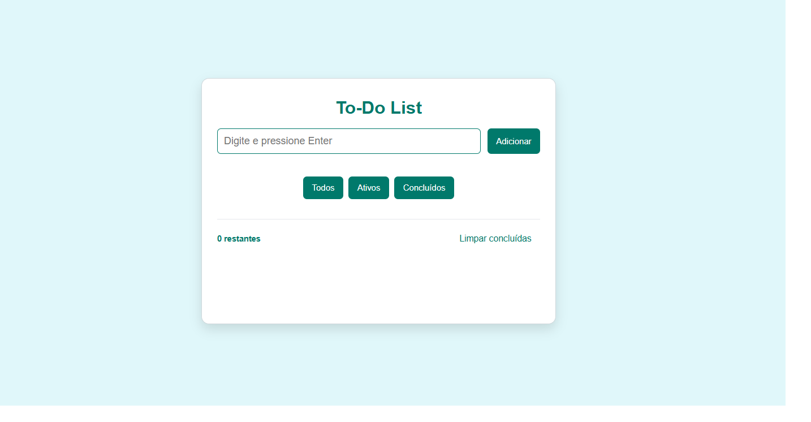

# 📝 To-Do List


Um gerenciador de tarefas simples, responsivo e intuitivo, desenvolvido com HTML, CSS e JavaScript. Permite adicionar, concluir, filtrar e excluir tarefas, com persistência automática no LocalStorage do navegador.

---

## ✨ Funcionalidades

- Adicionar novas tarefas
- Marcar tarefas como concluídas
- Filtrar por Todos | Ativos | Concluídos
- Remover tarefas individualmente ou todas concluídas
- Salvar automaticamente no navegador (LocalStorage)
- Layout responsivo (mobile e desktop)

---

## 📸 Preview



_Exemplo da interface principal da To-Do List: simples, intuitiva e responsiva. Adicione, filtre e gerencie suas tarefas facilmente!_

---

## 🛠️ Tecnologias Utilizadas

- HTML5
- CSS3 (Flexbox, responsividade, variáveis de cor)
- JavaScript (ES6+)
- LocalStorage

---

## 🌐 Demonstração

Acesse a versão online pelo [GitHub Pages](https://seu-usuario.github.io/seu-repo/) _(substitua pelo link real quando publicar)_

---

## 📂 Estrutura de Pastas

```text
/
├── index.html
├── style.css
├── script.js
└── README.md
```

---

## 📖 Como usar localmente

```bash
git clone https://github.com/ctorres4564/to-do-list.git
cd to-do-list-main
```

Abra o arquivo `index.html` no navegador de sua preferência (basta clicar duas vezes ou arrastar para o navegador).

---

## 🔮 Próximos Passos

- Editar tarefas já criadas ✏️
- Reordenar tarefas via drag-and-drop
- Melhorias de acessibilidade (atalhos de teclado, ARIA labels)
- Criar PWA para uso offline e instalação no celular
- Adicionar testes automatizados com Vitest/Jest

---

## 📌 Aprendizados

Durante o desenvolvimento, pratiquei:

- Manipulação de DOM com JavaScript puro
- Uso do LocalStorage para persistir dados
- Estruturação de layout com Flexbox
- Criação de interface responsiva
- Organização de código e boas práticas no GitHub

---

## 📄 Licença

Este projeto está sob a licença MIT. Sinta-se à vontade para usar e modificar como quiser.

---

## 🤝 Contribuindo

Contribuições são bem-vindas! Sinta-se livre para abrir issues ou pull requests com sugestões, correções ou melhorias.
